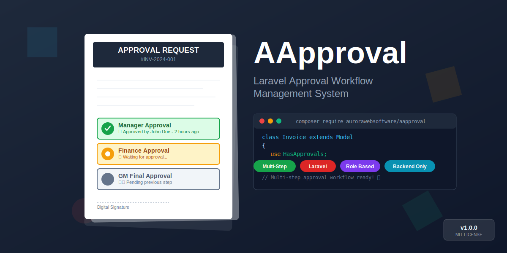

# AApproval - Laravel Approval Workflow Package



AApproval provides a powerful and flexible approval workflow system for create/update/delete operations in Laravel applications. This package is backend-only and does not include any frontend components.

## 🚀 Features

- **Multi-Step Approval System**: Support for complex approval processes with multiple steps
- **Flexible Approver Types**: Role, permission, and user-based approval mechanisms
- **Trait-Based Integration**: Easily integrate with your existing models
- **Automatic Workflow**: Automatically captures model operations and routes them to approval process
- **Full Customization**: Define different approval flows for each model
- **Laravel Authorization Integration**: Compatible with Laravel's existing authorization system

## 📋 Requirements

- PHP 8.1 or higher
- Laravel 11.0 or higher
- Spatie Laravel Permission package (recommended)

## 📦 Installation

Install the package via Composer:

```bash
composer require aurorawebsoftware/aapproval
```

Publish the configuration file:

```bash
php artisan vendor:publish --tag=aapproval-config
```

Publish migration files and run them:

```bash
php artisan vendor:publish --tag=aapproval-migrations
php artisan migrate
```

## ⚙️ Configuration

Define approval flows for each model in `config/approvals.php`:

```php
<?php

return [
    'flows' => [
        'App\\Models\\Invoice' => [
            [
                'name' => 'Manager Approval', 
                'type' => 'role', 
                'identifier' => ['manager']
            ],
            [
                'name' => 'Finance Approval', 
                'type' => 'role', 
                'identifier' => ['finance']
            ],
            [
                'name' => 'GM Approval', 
                'type' => 'user', 
                'identifier' => [1] // User IDs
            ],
        ],
        
        'App\\Models\\PurchaseOrder' => [
            [
                'name' => 'Department Head Approval',
                'type' => 'permission',
                'identifier' => ['approve-purchase-orders']
            ],
        ],
    ],
    
    // Permission name for direct approval bypass
    'permission_name' => 'approval_direct',
];
```

### Approver Types

1. **Role Based**: `'type' => 'role'`
    - Uses Spatie Laravel Permission package
    - Specify role names in `identifier` array

2. **Permission Based**: `'type' => 'permission'`
    - Uses Spatie Laravel Permission package
    - Specify permission names in `identifier` array

3. **User Based**: `'type' => 'user'`
    - For specific users
    - Specify user IDs in `identifier` array

### Direct Approval Permission

You can customize the permission name for bypassing approval workflow in the config file. Users with this permission can perform direct operations without going through approval process:

```php
'permission_name' => 'approval_direct', // or any custom permission name
```

## 🔧 Usage

### Adding Trait to Model

Add the `HasApprovals` trait to the model you want to use the approval system with:

```php
<?php

namespace App\Models;

use Illuminate\Database\Eloquent\Model;
use Aurorawebsoftware\AApproval\Traits\HasApprovals;

class Invoice extends Model
{
    use HasApprovals;
    
    protected $fillable = [
        'number',
        'amount',
        'description',
        // ... other fields
    ];
}
```

### Direct Operation Permission

For some users to perform direct operations bypassing the approval process:

```php
// Grant general direct approval permission (configured in config file)
$user->givePermissionTo(config('approvals.permission_name', 'approval_direct'));

// Grant direct approval permission for specific model
$user->givePermissionTo(config('approvals.permission_name', 'approval_direct') . ':App\\Models\\Invoice');
```

### Managing Approval Requests

```php
use Aurorawebsoftware\AApproval\Models\ApprovalRequest;
use Aurorawebsoftware\AApproval\Models\ApprovalStep;

// List pending approval requests
$pendingRequests = ApprovalRequest::where('status', 'pending')->get();

// Find steps that a specific user can approve
$user = auth()->user();
$approvableSteps = ApprovalStep::where('status', 'pending')
    ->get()
    ->filter(function ($step) use ($user) {
        return $step->canUserApprove($user);
    });

// Approve steps
foreach ($approvableSteps as $step) {
    try {
        $step->approve($user);
        echo "Step approved: " . $step->name;
    } catch (\Exception $e) {
        echo "Approval error: " . $e->getMessage();
    }
}
```
## 🎯 Example Scenario

```php
// 1. Define approval flow for Invoice model (in config/approvals.php)
'App\\Models\\Invoice' => [
    ['name' => 'Manager Approval', 'type' => 'role', 'identifier' => ['manager']],
    ['name' => 'Finance Approval', 'type' => 'role', 'identifier' => ['finance']],
]

// 2. Try to create new invoice
$invoice = new Invoice();
$invoice->number = 'INV-001';
$invoice->amount = 5000;
$invoice->save(); // This enters approval process, invoice is not created yet

// 3. Manager role user approves
$managerStep = ApprovalStep::where('status', 'pending')
    ->whereHas('approvalRequest', function($q) {
        $q->where('model_type', 'App\\Models\\Invoice');
    })
    ->first();

$managerUser = User::role('manager')->first();
$managerStep->approve($managerUser);

// 4. Finance role user approves
$financeStep = ApprovalStep::where('status', 'pending')
    ->where('approval_request_id', $managerStep->approval_request_id)
    ->first();

$financeUser = User::role('finance')->first();
$financeStep->approve($financeUser);

// 5. After all steps are approved, invoice is automatically created
```

## 📄 License

This project is licensed under the MIT License. See [LICENSE](LICENSE.md) file for details.

⭐ Don't forget to star the project if you like it!